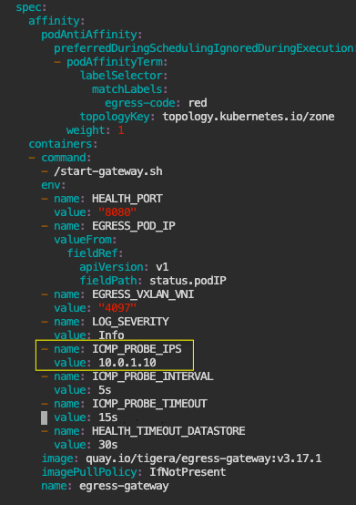

# In this lab

* [Overview](https://github.com/tigera-cs/Kubernetes-and-Container-Security-Instructor-Led-Workshop/blob/main/2.%20Chapter%201%20-%20Perimeter%20-%20Egress%20Gateway/egress_gateway.md#overview)
* [Implement Calico Enterprise Egress Gateway](https://github.com/tigera-cs/Kubernetes-and-Container-Security-Instructor-Led-Workshop/blob/main/2.%20Chapter%201%20-%20Perimeter%20-%20Egress%20Gateway/egress_gateway.md#implement-calico-enterprise-egress-gateway)


### Overview

In Kubernetes, Ingress traffic refers to any traffic that is initiated from outside the cluster to the services running inside the Kubernetes cluster. Egress traffic is just the opposite, any traffic that is initiated from the pods from within the cluster to the IP endpoints that are located outside the cluster. Kubernetes provides a native ingress resource to manage and control Ingress traffic. However, there is no native Kubernetes Egress resource. So when pods need to connect to an endpoint outside the cluster, they do so using their own IP addresses by default. Considering that an application could be implemented through one or more pods and the fact that pods in Kubernetes are ephemeral, it is almost impossible to identify and control the Kubernetes egress traffic from outside the cluster as the IP addresses are constantly changing. Egress gateways (EGWs) are pods that act as gateways for traffic leaving the cluster from certain client pods. The primary function of egress gateway is to configure the egress gateway client to have a particular and persistent source IP address when connecting to services outside the Kubernetes cluster.

To simplify the installation of th lab, we will be using the bastion instead of a router/ToR/Firewall, for the BGP peering and Egress Gateway configuration.


After finshing this lab, you should gain a good understanding of how to deploy Calico Enterprise Egress Gateway and establish a permanent identity for the traffic that is leaving the cluster.

______________________________________________________________________________________________________________________________________________________________________

### Implement Calico Enterprise Egress Gateway

1. Deploy the needed BGPConfiguration and BGPPeer so we route our traffic to the `bastion` host through the egress gateway.

```
kubectl apply -f - <<EOF
apiVersion: projectcalico.org/v3
kind: BGPConfiguration
metadata:
  name: default
spec:
  logSeverityScreen: Info
  nodeToNodeMeshEnabled: true
  nodeMeshMaxRestartTime: 120s
  asNumber: 64512
  serviceClusterIPs:
    - cidr: 10.49.0.0/16
  listenPort: 179
  bindMode: NodeIP
  communities:
  - name: bgp-large-community
    value: 64512:120
  prefixAdvertisements:
    - cidr: 10.10.10.0/31
      communities:
        - bgp-large-community
        - 64512:120
---
apiVersion: projectcalico.org/v3
kind: BGPPeer
metadata:
  name: my-global-peer
spec:
  peerIP: 10.0.1.10
  asNumber: 64512
EOF

```

2. Bastion host is simulating our upstream router/firewall and we should have BGP sessions established to all the cluster nodes using the above configurations. Run the following command on the bastion node to validate the bgp sessions from the bastion node to the cluster nodes.

```
watch sudo birdc show protocols
```

Wait for all sessions to be established on all k8s nodes (control1, worker1 and worker2)

```
BIRD 1.6.8 ready.
name     proto    table    state  since       info
direct1  Direct   master   up     23:42:33    
kernel1  Kernel   master   up     23:42:33    
device1  Device   master   up     23:42:33    
control1 BGP      master   up     23:42:35    Established   
worker1  BGP      master   up     23:42:36    Established   
worker2  BGP      master   up     23:42:35    Established
```
We must also set the bird config on the bastion to accept advertisements of the egress gateway network. To do so, you can modify the `/etc/bird/bird.conf` configuration file, with this command:


```
sudo sed -i 's/if (net ~ 10.50.0.0\/24) then accept;/if (net ~ 10.50.0.0\/24) then accept;\n                        if (net ~ 10.10.10.0\/31) then accept;/g' /etc/bird/bird.conf
```

Check that the route has been added correctly `if (net ~ 10.10.10.0/31) then accept;`:

```
sudo vi /etc/bird/bird.conf
```

```
# Import filter
filter rt_import {
                        if (net ~ 10.48.2.0/24) then accept;
                        if (net ~ 10.49.0.0/16) then accept;
                        if (net ~ 10.50.0.0/24) then accept;
                        if (net ~ 10.10.10.0/31) then accept; <-------
                        reject;
        }
```
And restart bird

```
sudo systemctl restart bird
```

3. Enable egress gateway support by patching FelixConfiguration to support egress gateway both per namespace and per pod.

```
kubectl patch felixconfiguration.p default --type='merge' -p '{"spec":{"egressIPSupport":"EnabledPerNamespaceOrPerPod"}}'
    
```
4. Egress gateways require the Policy Sync API to be enabled in `felixconfiguration` to implement symmetric routing. Run the following command to enable this configuration cluster-wide.

```
kubectl patch felixconfiguration.p default --type='merge' -p '{"spec":{"policySyncPathPrefix":"/var/run/nodeagent"}}'
    
```

5. Egress gateways use the IPPool resource for a particular application when it connects outside of the cluster. Run the following command to create the egress gateway IPPool.

```
kubectl apply -f - <<EOF
apiVersion: projectcalico.org/v3
kind: IPPool
metadata:
  name: egress-ippool-1
spec:
  cidr: 10.10.10.0/31
  blockSize: 32
  nodeSelector: "!all()"
EOF

```

6. Let's create a namespace and application, which will be using egress gateway to connect to resources outside the cluster.

```
kubectl apply -f -<<EOF
apiVersion: v1
kind: Namespace
metadata:
  name: app1
  labels:
    tenant: tenant1
---
apiVersion: apps/v1
kind: Deployment
metadata:
  name: app1-deployment
  namespace: app1
  labels:
    app: app1
    tenant: tenant1
spec:
  replicas: 2
  selector:
    matchLabels:
      app: app1
      tenant: tenant1
  template:
    metadata:
      labels:
        app: app1
        tenant: tenant1
    spec:
      containers:
      - name: app1
        image: praqma/network-multitool
        env:
        - name: HTTP_PORT
          value: "1180"
        - name: HTTPS_PORT
          value: "11443"
        ports:
        - containerPort: 1180
          name: http-port
        - containerPort: 11443
          name: https-port
        resources:
          requests:
            cpu: "1m"
            memory: "20Mi"
          limits:
            cpu: "10m"
            memory: "20Mi"
EOF

```

7. Make sure the pods are running.

```
kubectl get pods -n app1

```

8. Deploy the Egress gateway using the egress IP Pool. 

```

kubectl apply -f - <<EOF
apiVersion: operator.tigera.io/v1
kind: EgressGateway
metadata:
  name: egress-gateway
  namespace: default
spec:
  logSeverity: "Info"
  replicas: 1
  ipPools:
  - cidr: "10.10.10.0/31"
  egressGatewayFailureDetection:
    healthTimeoutDataStoreSeconds: 30
    icmpProbe:
      ips: ["127.0.0.1"]
      timeoutSeconds: 15
      intervalSeconds: 5
  template:
    metadata:
      labels:
        egress-code: red
    spec:
      nodeSelector:
        kubernetes.io/os: linux
      terminationGracePeriodSeconds: 0
EOF

```

**Note:** Since Tigera continously updates this manifest with the new features and configurations paramters, this manifest should be downloaded from the Tigera docs site and adapted to the use case:

https://docs.tigera.io/networking/egress/egress-gateway-on-prem#deploy-a-group-of-egress-gateways 

Note the following configurations:

* `egress-code: red` is the lable that we will use to annotate the egress gateway client pod or namespace to use the egress gateway as it egress proxy.
* `cidr: "10.10.10.0/31"` is the IPPool that was deployed to provide IP address to egress gateway pods. 

9. Make sure that the egress gateway pod is running.

```
kubectl get pods -o wide | grep egress

```

```
NAME                               READY   STATUS    RESTARTS   AGE    IP            NODE                                      NOMINATED NODE   READINESS GATES
egress-gateway-74c977bb77-5bxsm    1/1     Running   0          133m   10.10.10.0    ip-10-0-1-31.eu-west-1.compute.internal   <none>           <none>
```

10. Check the routes on the bastion node. You should see that the edge gateway pod is reachable through the worker node where it has been deployed:

```
ip route
```
```
default via 10.0.1.1 dev ens5 proto dhcp src 10.0.1.10 metric 100 
10.0.1.0/24 dev ens5 proto kernel scope link src 10.0.1.10 
10.0.1.1 dev ens5 proto dhcp scope link src 10.0.1.10 metric 100 
10.10.10.0/31 via 10.0.1.31 dev ens5 proto bird 
10.48.2.216/29 via 10.0.1.31 dev ens5 proto bird 
10.49.0.0/16 proto bird 
        nexthop via 10.0.1.20 dev ens5 weight 1 
        nexthop via 10.0.1.31 dev ens5 weight 1
```

11. We will now need to configure our egress gateway client (app1 application) to use the egress gateway. We could configure specific pods/deployments in app1 namespace to use the egress gateway by annotating the pods/deployment or all the pods/deployments in app1 namespace by annotating the namespace. Since we only have a single app in app1 namespace, we will configure the annotation on the namespace.

```
kubectl annotate ns app1 egress.projectcalico.org/selector='egress-code == "red"'

```
12. By default, the above selector can only match egress gateways in the same namespace. To select gateways in a different namespace, specify a namespaceSelector annotation as well. Since our egress gateway pod is running in `default` namespace and our egress gateway client is running in `app1` namespace, we need to run the following command.

```
kubectl annotate ns app1 egress.projectcalico.org/namespaceSelector="projectcalico.org/name == 'default'"

```

13. Let verify our egress gateway configurations in action and ensure that `app1` IP address are proxied by egress gateway when connecting to services outside the cluster. Open a second terminal to your lab instance. On that terminal, start netcat on the `bastion` host to listen to a specific port.

```
netcat -nvlkp 7777

```

14. On the original terminal window, exec into any of the pods in the app1 namespace.

```
APP1_POD=$(kubectl get pod -n app1 --no-headers -o name | head -1) && echo $APP1_POD

```
```
kubectl exec -ti $APP1_POD -n app1 -- sh
```

15. Try to connect to the port in the bastion host.

```
nc -zv 10.0.1.10 7777

```

16. Type `exit` to exit out the pod terminal.

```
exit
```

17. Go to the terminal that you ran the following netcat server on the `bastion` node. You should see an output saying you connected from the IP of the egress gateway pod to the netcat server.

```
tigera@bastion:~$ netcat -nvlkp 7777
Listening on 0.0.0.0 7777
Connection received on 10.10.10.0 39457
```

18. Stop the netcat listener process in the `bastion` host with `^C`.

19. Let's check on the special routing that Felix has implemented to proxy the `app1` traffic through the egress gateway. Check where the egress gateway client pods are running. 

```
kubectl get pods -n app1 -o wide

```

```
NAME                               READY   STATUS    RESTARTS   AGE     IP            NODE                                      NOMINATED NODE   READINESS GATES
app1-deployment-6ccc9654cb-c8ztq   1/1     Running   0          3h50m   10.48.0.60    ip-10-0-1-31.eu-west-1.compute.internal   <none>           <none>
app1-deployment-6ccc9654cb-wjnfl   1/1     Running   0          3h50m   10.48.0.210   ip-10-0-1-30.eu-west-1.compute.internal   <none>           <none>
```

20. Log into the worker node where the egress gateway client pod `app1` is running. In this case, there are two pods and each one is running on a different worker node. Choose a node where the `app1` is running on and ssh into that node. Note `app1` pod IP address running on worker2. It is `10.48.0.60` in this case.

```
ssh worker2
```

21. Observe the routing policy that is programmed for the the `app1` workload POD IP address `10.48.0.60`.

```
ip rule
```

```
0:      from all lookup local
100:    from 10.48.0.60 fwmark 0x80000/0x80000 lookup 250
32766:  from all lookup main
32767:  from all lookup default
```

22. Confirm that the policy is choosing the egress gateway as the next hop for any source traffic from `app1`.
#### Note: ensure to use the correct table number with the following command. In this case, the table number is 250.

```
ip route show table 250

```

```
default via 10.10.10.0 dev egress.calico onlink 
```

23. Starting Calico Enterprise 3.15, egress gateway supports using HTTP and ICMP probes for readiness health checking. If all probes of one type `ICMP/HTTP` fail, egress gateway pod failing the probe goes non-Ready. Let's configure our egress-gateway deployment to ping bastion node `10.0.1.10` for readiness check. Should this ping fail, egress gateway pod should go non-ready. Use the following command and set the value for `ICMP_PROBE_IPS` to `10.0.1.10`. Then save and exit. Egress gateway pod should restart because of this change.

```
kubectl edit deployments.apps egress-gateway

```



24. Make sure that the egress gateway pod is running by running the following command.

```
kubectl get pods -o wide | grep egress
```

```
NAME                               READY   STATUS    RESTARTS   AGE    IP            NODE                                      NOMINATED NODE   READINESS GATES
egress-gateway-74c977bb77-rcvkb    1/1     Running   0          10s   10.10.10.0    ip-10-0-1-31.eu-west-1.compute.internal   <none>           <none>
```

25. Let's now implement a security policy that blocks ICMP traffic from egress gateway pod to `10.0.1.10`, but allows every other traffic.

```
kubectl apply -f -<<EOF
apiVersion: projectcalico.org/v3
kind: NetworkPolicy
metadata:
  name: default.egress-gateway-allow-everything-deny-ping-to-bastion
  namespace: default
spec:
  tier: default
  selector: egress-code == "red"
  serviceAccountSelector: ''
  egress:
    - action: Deny
      protocol: ICMP
      source: {}
      destination:
        nets:
          - 10.0.1.10/32
    - action: Allow
      source: {}
      destination: {}
  types:
    - Egress
EOF

```

26. `ICMP_PROBE_TIMEOUT` environment variable is configured to `15s` by default. It should take about 15-20s after implementing the above policy for the egress gateway pod to show as non-ready as depiected below.

```
kubectl get pods -o wide | grep egress
```

```
NAME                               READY   STATUS    RESTARTS   AGE    IP            NODE                                      NOMINATED NODE   READINESS GATES
egress-gateway-74c977bb77-rcvkb    0/1     Running   0          3m15s   10.10.10.0    ip-10-0-1-31.eu-west-1.compute.internal   <none>           <none>
```

27. Wait 30 seconds and follow the same connectivity steps that were done from step 13-17 above. You should no longer be able to make connections from `app1` to `10.0.1.10` because the ICMP probe of the Egress Gateway pod is failing.

You can check logs of the Egress Gateway pod with this command:

```
kubectl logs -l egress-code=red
```

28. Clean up the resources that were deployed for the purpose of this lab.

```
kubectl delete ns app1

```
```
kubectl delete networkpolicies.pro egress-gateway-allow-everything-deny-ping-to-bastion

```
```
kubectl delete deployments egress-gateway

```

> **Congratulations! You have completed `2. Chapter 1 - Perimeter - Calico Enterprise Egress Gateway` lab.**