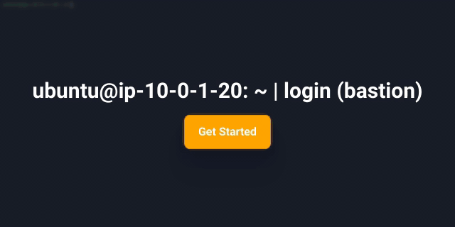
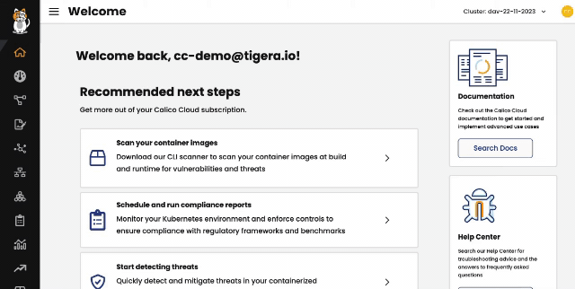
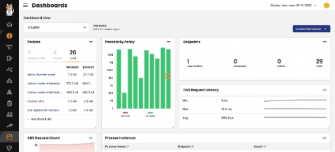

# In this lab

* [Overview](https://github.com/tigera-cs/Kubernetes-and-Container-Security-Instructor-Led-Workshop/blob/main/6.%20Chapter%202%20-%20Cluster%20%26%20Pod%20-%20Image%20Assurance/image_assurance.md#overview)
* [Implement Calico Cloud Image Assurance](https://github.com/tigera-cs/Kubernetes-and-Container-Security-Instructor-Led-Workshop/blob/main/6.%20Chapter%202%20-%20Cluster%20%26%20Pod%20-%20Image%20Assurance/image_assurance.md#implement-calico-cloud-image-assurance)


### Overview

Calico Cloud Image Assurances helps you identify vulnerabilities in container images that you deploy to Kubernetes clusters. Vulnerabilities are known flaws in libraries and packages used by applications that attackers can exploit and cause harm.

Image Assurance is based on the Common Vulnerabilities and Exposures (CVE) system, which provides a catalog of publicly-known security vulnerabilities and exposures. Known vulnerabilities are identified by a unique CVE ID based on the year it was reported (for example, CVE-2021-44228).

When you enable Image Assurance, the daemonSet "tigera-image-assurance-crawdad" is created in the "tigera-image-assurance" namespace

Scanned image content includes:
- Libraries and content (for example, python, ruby gems, jars and go)
- Packages (OS and non-OS)
- Image layer

In this lab, we will enable Image Assurance, scan images automatically and manually, and investigate on scanned and running images.
______________________________________________________________________________________________________________________________________________________________________

### Implement Calico Cloud Image Assurance

1. To enable Image Assurance, we need to edit its configuration `kubectl edit imageassurances default` setting the `clusterScanner` field to `Enabled` and save the file.

[](https://app.arcade.software/share/Q9nCQSf3XKTtInvckFlj)

The cluster scanner is deployed as a container inside the tigera-image-assurance-crawdad daemonset.

2. Verify that a new container with name, cluster-scanner is created inside the daemonset:

```
kubectl get daemonset -n tigera-image-assurance tigera-image-assurance-crawdad -o=jsonpath='{.spec.template.spec.containers[*].name}'
```

3. At this stage, the automatic scanning is already in place. Let's test its capabilities by creating the following malicious pod:

```
kubectl run log4j --image  quay.io/jsabo/log4shell-vulnerable-app
```

From Calico Cloud UI > Image Assurance > All Scanned Images, you should see the image that the pod just pulled.

You can also filter it out by the known CVE `CVE-2021-44228`

Then click on the image and take a look at the information provided in the sliding widget:
- number of unique CVEs matched 
- number of vulnerable packages 
- number of CVEs matched against each package
- package CVSS score(highest CVSS score displayed in the list)

[](https://app.arcade.software/share/1mur9oeiC5oxZQhzGUxq)

Afterwords, go to Running Images and find the same image. Click on the image and confirm that it is running on your cluster.

[](https://app.arcade.software/share/cC2KdaZ5CIcYq6EmrhES)

4. Manual scanning

You may also want to scan a registry before pulling any image from it. To do so:

- Download the tigera-scanner locally:

```
sudo curl -Lo tigera-scanner https://installer.calicocloud.io/tigera-scanner/v3.18.0-1.1-1/image-assurance-scanner-cli-linux-amd64
```

- Make it executable:

```
sudo chmod +x ./tigera-scanner
```

- Install docker

```
sudo apt install docker.io
```

- Pull the image locally:

```
sudo docker pull quay.io/jsabo/log4shell-vulnerable-app:latest
```

- Scan the image locally:

```
sudo ./tigera-scanner scan quay.io/jsabo/log4shell-vulnerable-app:latest
```

[](https://app.arcade.software/share/juV5zWYjtmI84iMr5iYK)

Finally, should you like to save the output of the scan to Calico Cloud, you need to retrieve the `API URL` and `API TOKEN` from Calico Cloud UI and use them push the result using this command:

```
sudo ./tigera-scanner scan quay.io/jsabo/log4shell-vulnerable-app:latest --apiurl URL_URL_URL --token TOKEN_TOKEN_TOKEN
```

[]

> **Congratulations! You have completed `6. Chapter 2 - Custer & Pod - Calico Cloud Image Assurance` lab.**