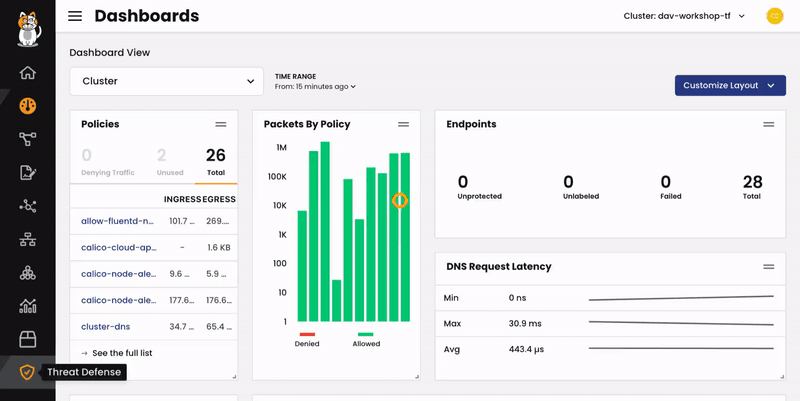
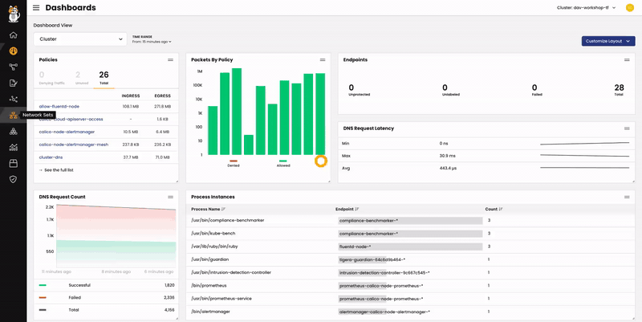
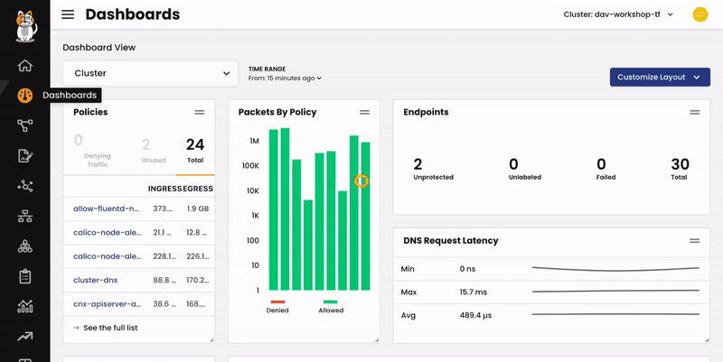
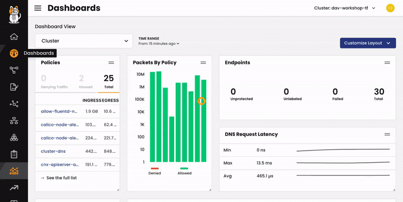

# In this lab

* [Overview](https://github.com/tigera-cs/Kubernetes-and-Container-Security-Instructor-Led-Workshop/blob/main/8.%20Chapter%203%20-%20Runtime%20-%20Threat%20Feed%20%26%20DGA/threat_feed_dga.md#overview)
* [Implement Calico Cloud Threat Feed](https://github.com/tigera-cs/Kubernetes-and-Container-Security-Instructor-Led-Workshop/blob/main/8.%20Chapter%203%20-%20Runtime%20-%20Threat%20Feed%20%26%20DGA/threat_feed_dga.md#implement-calico-cloud-threat-feed)


### Overview

Firewalls often detect and block traffic associated with known bad actors, but don’t have granular visibility into which pod is infected. Calico’s threat feed can pinpoint and report on the exact source of malicious traffic.

Calico Cloud ingests threat feeds that identify IP addresses for known bad actors, such as botnets. Any traffic to those IPs is automatically blocked and generates an alert. All the workloads in the cluster will be protected with a block-alienvault-ipthreatfeed security policy, which is enabled to block egress and ingress traffic.

Calico’s threat feed deployment consists of 3 main components: a threat feed resource, a network set resource, and a global network policy.

1. The threat feed resource pulls updates automatically on a daily basis. The threat feed(s) must be available using HTTP(S), and return a newline-separated list of IP addresses or prefixes in CIDR notation.
2. A network set resource (NetworkSet) represents an arbitrary set of IP subnetworks/CIDRs, and gets updated periodically by the threat feeds. The metadata for the network set includes a set of labels. These labels are used to create the network policy to block the traffic.
3. A global network policy blocks traffic to any of the suspicious IPs. Notice that the suspicious IPs are not defined in the network policy manifest; instead, Calico uses a selector (in our case 'feed == "training-ip-threatfeed"'), which refers to the NetworkSet.

______________________________________________________________________________________________________________________________________________________________________

### Implement Calico Cloud Threat Feed

1. As the first step, we turn down the aggregation of flow logs sent to Elasticsearch to get more useful results from threat feed searches:

```
kubectl patch felixconfiguration default --type='merge' -p '{"spec":{"flowLogsFileAggregationKindForAllowed":1}}'
```

2. Now, to configure Threat Feed, we need to deploy the GlobalThreatFeed resource for an IP list, which will also create a GlobalNetworkSet for the IPs included in the list. The IP list that we are going to use for this test is 'https://installer.calicocloud.io/feeds/v1/ips' and we can deploy the 2 resources, with this command:

```
cat << EOF | kubectl apply -f -
kind: GlobalThreatFeed
apiVersion: projectcalico.org/v3
metadata:
  name: training.ip.threatfeed
spec:
  content: IPSet
  mode: Enabled
  description: AlienVault IP Block List
  feedType: Builtin
  globalNetworkSet:
    labels:
      feed: training-ip-threatfeed
  pull:
    http:
      format: {}
      url: 'https://raw.githubusercontent.com/tigera-cs/Kubernetes-and-Container-Security-Instructor-Led-Workshop/main/8.%20Chapter%203%20-%20Runtime%20-%20Threat%20Feed%20%26%20DGA/threat_feed_list?token=GHSAT0AAAAAACGKLDKZHM6XZDQHD74RJGY4ZLKC3KQ'
EOF
```

NOTE: 

This is the part of the manifest which creates the Global Network Set from the IP list of the Global Threat Feed resource:
```
  globalNetworkSet:
    labels:
      feed: training-ip-threatfeed
```

***IMPORTANT: Do not use the list above in production. That list has been created for the only purpose of this lab.***

3. Let's verify from Calico Cloud UI that the Global Threat Feed list and the Global Network Set were created.

- Global Threat Feed list: Threat Defense > Threat Feeds:



- Global Network Set: Network Sets:



4. At this stage, if a pod tries to connect to suspicious IPs included in our list, some alerts will be generated. We can test this applying the following pod:

NOTE: The pod will send a curl command to a known suspicious IP every 60 seconds, and save the output to its `/var/log/activity.log` log file.

```
cat << EOF | kubectl apply -f -
apiVersion: v1
kind: Pod
metadata:
  name: red
spec:
  containers:
  - name: red
    image: wbitt/network-multitool
    command:
      - "/bin/sh"
      - "-c"
      - "while true; do curl -sI -m 2 http://10.48.255.194 || echo 'Timeout' >> /var/log/activity.log; sleep 60; done"
    volumeMounts:
    - name: log-volume
      mountPath: /var/log
  volumes:
  - name: log-volume
    emptyDir: {}
EOF

```

5. Let's check the output saved by the `red` pod, with this command:

```
 kubectl exec -it red -- tail -f /var/log/activity.log
```

As you can see, the response from the server is `HTTP/1.1 200 OK`:

```
HTTP/1.1 200 OK
Date: Mon, 20 Nov 2023 14:49:18 GMT
Server: Apache/2.4.6 (CentOS) OpenSSL/1.0.2k-fips PHP/7.2.34
Last-Modified: Thu, 16 Nov 2023 04:18:37 GMT
ETag: "24b-60a3d505619f9"
Accept-Ranges: bytes
Content-Length: 587
Content-Type: text/html; charset=UTF-8
```

6. This suspicious activity, even though is still allowed, is generating some alerts in Calico Cloud UI. Verify these alerts from `Service Graph` or `Activity > Alerts`:

A. From `Service Graph`:

[](https://app.arcade.software/share/WsmHqUoWzIEVOAmzx8zz)

B. From `Activity > Alerts`:

[](https://app.arcade.software/share/QF8ZAMRNRoQ1eVYza6nD)


7. We have confirmed that the GlobalThreatFeed resource will only detect suspicious activity and generate alerts. To block these attempts, we need to create a Global Network Policy which will refers to the Global Network Set, using the label `feed == training-ip-threatfeed`. You can deploy the `tigera-security` tier and the `block-alienvault-ipthreatfeed` policy using this command:

```
cat << EOF | kubectl apply -f -
---
apiVersion: projectcalico.org/v3
kind: Tier
metadata:
  name: tigera-security
spec:
  order: 300
---
apiVersion: projectcalico.org/v3
kind: GlobalNetworkPolicy
metadata:
    name: tigera-security.block-training-ipthreatfeed
spec:
  tier: tigera-security
  selector: all()
  namespaceSelector: ''
  serviceAccountSelector: ''
  egress:
  - action: Deny
    source: {}
    destination:
      selector: feed == "training-ip-threatfeed"
  - action: Pass
    source: {}
    destination: {}
  types:
  - Egress
EOF
```

8. Let's have a look again, at the output saved by the `red` pod:

```
 kubectl exec -it red -- tail -f /var/log/activity.log
```

As you can see, the response saved by the pod is now `Timeout`.

9. From `Service Graph` we can confirm that the traffic is denied, and you can tell this from the color of the arrow between the `default` namespace and the `threatfeed.training.ip.threatfeed` Global Network Set, as well as from alert's details:

[](https://app.arcade.software/share/Eo3MvbQ76O8Gp4yUfZSF)


10. You can verify the same from `Activity > Alerts`:

[](https://app.arcade.software/share/CoTdb8osmgGKlJDONxTA)

11. It's time to delete what we have created for this training and dismiss alerts from Calico Cloud UI:

A. Delete `red` pod:
```
kubectl delete pod red
```

B. Dismiss all the alerts from `Activity > Alerts`:

[](https://app.arcade.software/share/wREfpjxHgnd88H6Q7w9m)


C. Delete the global network policy `block-training-ipthreatfeed` in the `tigera-security` tier:
```
kubectl delete globalnetworkpolicy tigera-security.block-training-ipthreatfeed
```

D. Delete the `tigera-security` tier:
```
kubectl delete tier tigera-security
```

E. Delete the `training.ip.threatfeed` global threat feed list
```
kubectl delete globalthreatfeed training.ip.threatfeed
```


> **Congratulations! You have completed `8. Chapter 3 - Runtime - Calico Cloud Threat Feed` lab.**