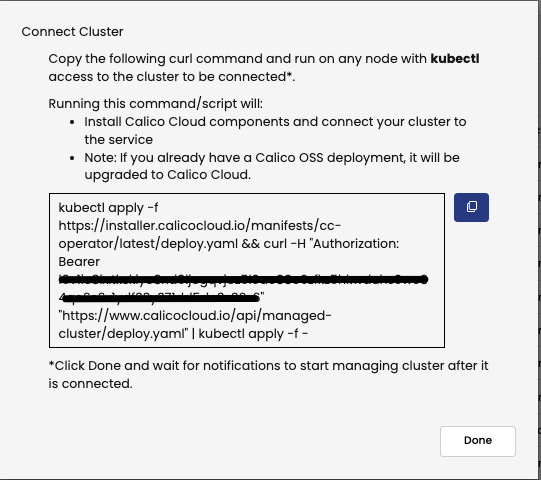

# Kubernetes and Container Security Workshop


## Objectives

Supporting documentation for Kubernetes and Container Security Workshop. The intent of this workshop is to provide provide you with a guided approach on how to implement an IDS/IPS solution for your Kubernetes cluster. We will start at the edge of the cluster and continue south towards the application, highlighting the different points we can implement an IDS/IPS strategy for your Kubernetes cluster.

- [1. Chapter 1 - Perimeter - Firewall Integration](1.%20Chapter%201%20-%20Perimeter%20-%20Firewall%20Integration/README.md)
- [2. Chapter 1 - Perimeter - Egress Gateway](2.%20Chapter%201%20-%20Perimeter%20-%20Egress%20Gateway/egress_gateway.md)
- [3. Chapter 1 - Perimeter - WAF](3.%20Chapter%201%20-%20Perimeter%20-%20WAF/waf.md)
- [4. Chapter 2 - Cluster & Pod - DPI](4.%20Chapter%202%20-%20Cluster%20%26%20Pod%20-%20DPI/dpi.md)
- [5. Chapter 2 - Cluster & Pod - WAF](5.%20Chapter%202%20-%20Cluster%20%26%20Pod%20-%20WAF/waf.md)
- [6. Chapter 2 - Cluster & Pod - Image Assurance](6.%20Chapter%202%20-%20Cluster%20%26%20Pod%20-%20Image%20Assurance/image_assurance.md)
- [7. Chapter 3 - Runtime - Container Detectors](7.%20Chapter%203%20-%20Runtime%20-%20Container%20Detectors/container_detectors.md)
- [8. Chapter 3 - Runtime - Threat Feed & DGA](8.%20Chapter%203%20-%20Runtime%20-%20Threat%20Feed%20%26%20DGA/threat_feed_dga.md)


## The lab architecture


<p align="center">
  
</p>

Hosts/nodes:

*  10.0.0.2/32: DNS Server for the subnet 10.0.1.0/24
*  10.0.1.1/32: Default gateway for the subnet 10.0.1.0/24
*  10.0.1.10/32: Bastion Host - Linux server that plays the roles of BGP ToR and Jump server
*  10.0.1.20/32: Kubernetes Master node (Control1) 
*  10.0.1.30/32: Kubernetes Worker node (Worker1)
*  10.0.1.31/32: Kubernetes Worker node (Worker2)

## Initial setup

The nodes are in Not Ready status so it means there is no CNI configured.

```bash
kubectl get nodes
```
```bash
NAME                                         STATUS     ROLES                  AGE   VERSION
ip-10-0-1-20.ca-central-1.compute.internal   NotReady   control-plane,master   49m   v1.22.4
ip-10-0-1-30.ca-central-1.compute.internal   NotReady   worker                 49m   v1.22.4
ip-10-0-1-31.ca-central-1.compute.internal   NotReady   worker                 49m   v1.22.4
```

### a. Install the Calico Operator

```bash
kubectl apply -f https://raw.githubusercontent.com/projectcalico/calico/v3.26.4/manifests/tigera-operator.yaml
```

### b. Verify if the Calico Operator has successfully deployed:

```bash
kubectl rollout status -n tigera-operator deployment tigera-operator
```
```bash
deployment "tigera-operator" successfully rolled out
```

### c. Download the custom resource manifest.

```bash
curl https://raw.githubusercontent.com/projectcalico/calico/v3.26.4/manifests/custom-resources.yaml -O
```

### d. Change the POD CIDR from 192.168.0.0/16 to 10.48.0.0/16 and disable the encapsulation as per the commands below:

```bash
sed -i 's,192\.168\.0\.0\/16,10\.48\.0\.0\/16,g' custom-resources.yaml
sed -i 's,VXLANCrossSubnet,None,g' custom-resources.yaml
```

### e. Apply the custom-resource:

```bash
kubectl apply -f custom-resources.yaml
```

### f. Check and wait until the node status is Ready:

```bash
watch kubectl get nodes
```
```bash
NAME                                         STATUS   ROLES                  AGE   VERSION
ip-10-0-1-20.ca-central-1.compute.internal   Ready    control-plane,master   61m   v1.22.4
ip-10-0-1-30.ca-central-1.compute.internal   Ready    worker                 60m   v1.22.4
ip-10-0-1-31.ca-central-1.compute.internal   Ready    worker                 60m   v1.22.4
```
### g. Check and wait until the apiserver and calico are available:

```bash
watch kubectl get tigerastatus
```
```bash
NAME        AVAILABLE   PROGRESSING   DEGRADED   SINCE
apiserver   True        False         False      52s
calico      True        False         False      92s
```

## 3. Install Calico Cloud in the cluster

### a. In Calico Cloud UI, click in the Managed Cluster icon , in the bottom “Connect Cluster”, insert the desired name for the cluster (put the cluster name), select the “Kubeadm” and click “Next”


### b. In the next screen, click “Next” then copy and paste the command into the lab

<p align="center">
  
</p>

### c. Wait for all services become available:

```bash
watch kubectl get tigerastatus
```
```bash
NAME                            AVAILABLE   PROGRESSING   DEGRADED   SINCE
apiserver                       True        False         False      2m55s
calico                          True        False         False      40s
compliance                      True        False         False      25s
intrusion-detection             True        False         False      40s
log-collector                   True        False         False      10s
management-cluster-connection   True        False         False      80s
monitor                         True        False         False      100s
```

### d. Check in the Managed Cluster icon  if the cluster is showing as “Connected”

